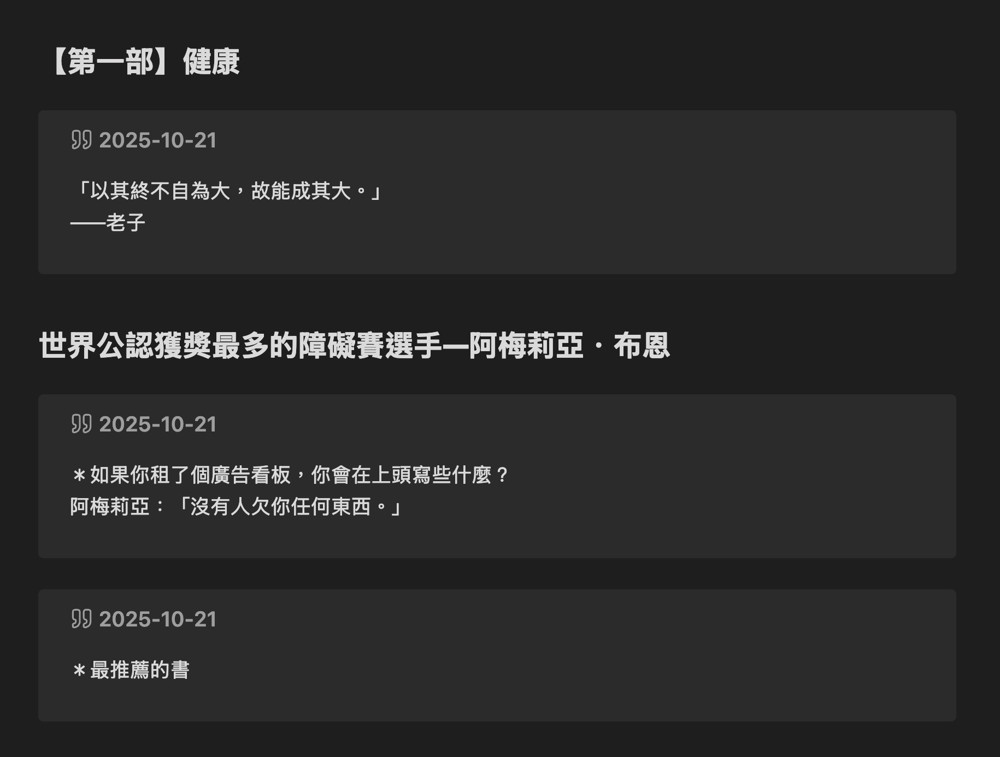
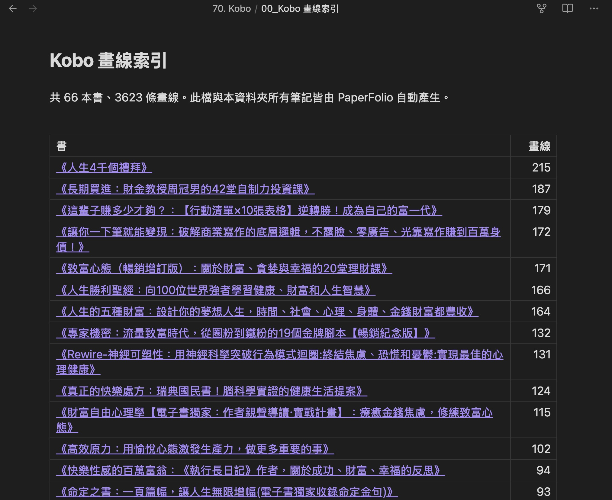
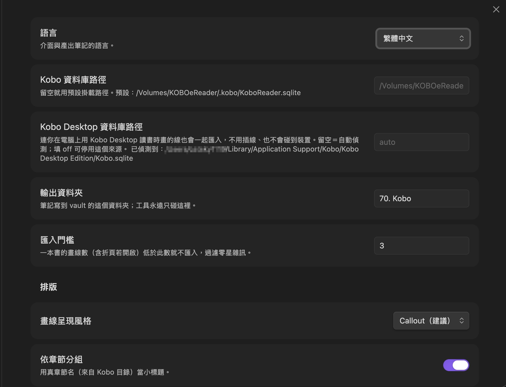

[English](README.md) ｜ **繁體中文**

# PaperFolio - Kobo Highlights

把 Kobo 的畫線乾淨地匯入 Obsidian：**一本書一則筆記**，依真實閱讀順序排列、用真章節名分組，而且你自己寫的東西完全不會被動到。

支援用 USB 連接 Kobo 電子書閱讀器、**Kobo 電腦版 App**（不用插線），也可以選擇走區網，讓 Kobo 上點一下就把畫線傳過來。

> 桌面版專用。所有資料都留在你自己的電腦：沒有帳號、沒有伺服器、沒有任何追蹤。



## 為什麼再做一個 Kobo 外掛

多數匯入工具只是把畫線倒成一長串。PaperFolio 在意的是「幾個月後回頭看，這份筆記還不好用」：

- **真實閱讀順序**：畫線依照它在書中的位置排序，不是依你畫線的時間。回頭補畫前面的段落，不會被丟到最後面。

- **真章節名**：章節來自書的目錄，而不是 `bodymatter_0_5.xhtml` 這種內部檔名。商店書若在資料庫裡沒有目錄資料，會去讀書本身的 EPUB 把真章節名找回來。

- **你的手寫心得受保護**：自動產生的內容包在哨兵區塊裡，重新同步只會重寫那個區塊，你寫在區塊外的總結永遠不會被動。

- **同時讀多個來源**：連接的 Kobo 與 Kobo 電腦版 App 會在同一次同步中合併，兩邊畫的線都會進來。

## 功能

- 一本書一則筆記，含 frontmatter（書名、作者、ISBN、日期）。

- 畫線呈現風格：callout、引用區塊、條列，三選一。

- 依章節分組；可選擇顯示日期與顏色標籤。

- 增量更新、自動去重——重新同步不會把你的筆記洗版。

- 自動產生索引筆記，依畫線數列出所有書。

- 匯入門檻：只有零星一兩條畫線的書可以自動略過。

- 折頁為選配（只記位置——Kobo 本身沒有存折頁的文字）。

- 介面與筆記支援英文與繁體中文，預設跟著 Obsidian 的語言走。



## 三種來源

可以任意搭配，一次同步就會全部合併。

### 一、用 USB 連接 Kobo

把 Kobo 插上電腦、等它掛載，然後點左側的圖示，或執行命令「同步 Kobo 畫線到 Obsidian」。外掛會自動偵測預設的掛載路徑，你也可以自己指定 `KoboReader.sqlite` 的位置。

### 二、Kobo 電腦版 App（不用插線）

如果你在電腦上用 Kobo App 讀書，那邊畫的線也會一起匯入。外掛會自動偵測它的本機資料庫；設定留空就是自動偵測，填 `off` 則停用這個來源。

### 三、區網無線（選配，預設關閉）

Obsidian 開著的時候，外掛可以聽一個埠，讓同一個 WiFi 的 Kobo 點一下就把畫線推過來，完全不用線。

1. 在設定裡打開「無線接收（區網）」。作業系統可能會問是否允許接受連線。

2. 設定頁會顯示你的同步位址（例如 `http://192.168.1.20:8321/sync`）與一組密鑰。

3. 在 Kobo 上用 NickelMenu 加一顆按鈕，執行一個小腳本把 `KoboReader.sqlite` 帶著密鑰上傳到那個位址。詳見 [`kobo/INSTALL.md`](kobo/INSTALL.md)。

章節名會從先前的 USB 同步快取起來，所以無線同步雖然讀不到 EPUB，一樣保有完整的章節分組。

## 設定

| 設定 | 說明 |
| :-- | :-- |
| 語言 | 介面與筆記語言（自動／English／繁體中文）|
| Kobo 資料庫路徑 | 留空＝預設掛載路徑 |
| Kobo Desktop 資料庫路徑 | 留空＝自動偵測，填 `off`＝停用 |
| 輸出資料夾 | 外掛唯一會寫入的資料夾 |
| 匯入門檻 | 畫線數低於此值的書就略過 |
| 畫線呈現風格 | Callout ／ 引用區塊 ／ 條列 |
| 依章節分組、顯示日期、顏色轉標籤、檔名格式 | 排版相關 |
| 匯入折頁、折頁標籤 | 折頁（預設關閉）|
| 無線接收 | 啟用、埠、密鑰、同步位址 |



## 你的筆記會怎麼被更新

自動產生的畫線會包在哨兵區塊裡：

```markdown
# 書名

你寫在這裡的任何東西都是你的，永遠不會被修改。

<!-- KOBO:START 自動維護，勿手改此區塊內文字 -->
...自動產生的畫線...
<!-- KOBO:END -->
```

重新同步只會替換兩個標記之間的內容，並更新 frontmatter 裡的 `last_synced`。區塊以外的部分，完全維持你原本寫的樣子。

## 隱私與安全

- **資料不會離開你的電腦**：外掛不會對外發出任何網路請求，也沒有任何遙測。沒有帳號，不經過任何第三方服務。

- **絕不修改你的 Kobo**：資料庫只會被讀進記憶體解析，外掛從不寫入你的裝置。

- **關於讀取 vault 以外的檔案**：因為 Kobo 的資料庫本來就存在裝置上（或電腦版 App 的資料夾裡），外掛需要直接讀那些路徑。但寫入只會發生在你的 vault 裡，而且只寫進你指定的輸出資料夾。

- **無線接收預設是關閉的**：啟用後它會綁定 `0.0.0.0`，讓同一個區網的裝置連得到——這是 Kobo 能一鍵同步的必要條件。它由一組隨機產生的密鑰保護（放在 `X-PaperFolio-Token` 標頭），只接受 `POST /sync` 上傳 SQLite 檔（上限 200 MB）以及 `GET /ping` 健康檢查；Obsidian 關閉或設定關掉時就會停止。

- **桌面版專用**（`isDesktopOnly: true`），因為讀取資料庫與執行選配的接收端需要用到 Node 的 API（`fs`、`http`、`os`、`crypto`）。

## 疑難排解

- **出現「找不到 Kobo 資料庫」**：確認 Kobo 已經掛載，或到設定裡指定路徑。

- **無線同步沒收到**：確認 Obsidian 開著且接收功能已啟用、兩台裝置在同一個網路，以及 Kobo 腳本裡的位址與密鑰跟設定頁一致。

- **IP 變了**：家用路由器會換發位址，把 Kobo 腳本裡的位址更新即可；或在路由器把電腦設成固定 IP 一勞永逸。

- **資料庫損壞**：如果 Kobo 的資料庫顯示損毀，通常可以用 `sqlite3 壞檔.sqlite ".recover" | sqlite3 救回.sqlite` 搶救，再把外掛的路徑指向搶救出來的檔案來匯入。

## 開發

```bash
npm install
npm run dev     # 監看模式，輸出 main.js
npm run build   # 型別檢查 + 打包
```

要測試打包結果，把 `main.js`、`manifest.json`、`styles.css` 複製到 `<vault>/.obsidian/plugins/paperfolio-kobo/`，然後重新載入 Obsidian。

## 致謝

SQLite 解析使用 [sql.js](https://github.com/sql-js/sql.js)；讀取 EPUB 目錄使用 [fflate](https://github.com/101arrowz/fflate)。兩者皆為 MIT 授權。

Kobo 是 Rakuten Kobo Inc. 的商標。本專案與 Rakuten Kobo Inc. 無任何從屬或背書關係。

## 授權

MIT，見 [LICENSE](LICENSE)。
